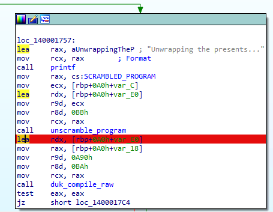
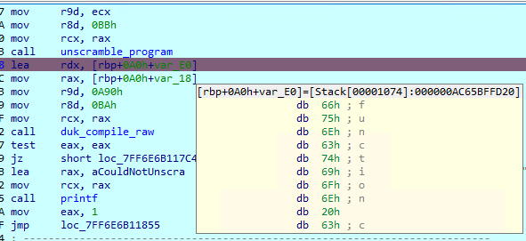
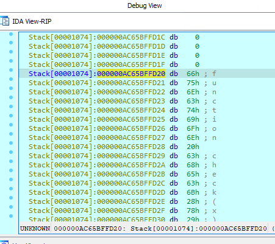
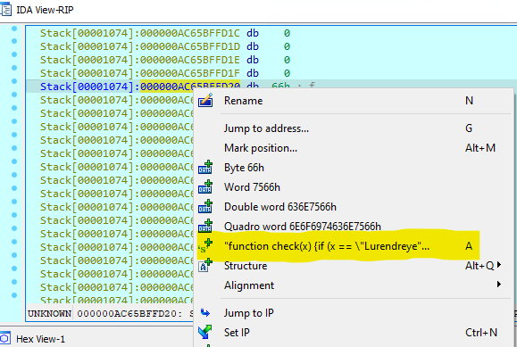

The program is a C application with an embedded Javascript interpreter (specifically Duktape).

The program first calculates the number of days that have passed to determine whether it's Christmas. Set the system clock to December 24 2023 to bypass this check (simply skipping the check will make unscrambling fail.)

Then, the program prompts you to answer a trick question. This question is evaluated by a Javascript function - however, this function is hidden with an XOR cipher seeded by the earlier number of days. The easiest way to circumvent this is to look at the program before it's loaded into the interpreter. Do this by setting a breakpoint after the call to `unscramble_program`, as shown here in IDA:



Start the debugger, and check the destination of `unscramble_program` on the stack:



Interpret the contents at the stack address as a string to uncover the flag check logic:





This reveals the function

```
function check(x) {if (x == \"Lurendreyer\") { return \"Correct! The flag is d:ctf{all-i-want-for-christmas-is-a-debugger}\";} else { return \"No presents for you, better luck next year!\"; }}
```

which gives you the flag, `d:ctf{all-i-want-for-christmas-is-a-debugger}`

Author's note: `unscramble_program` was supposed to use `key` as a parameter, but `offset` refers to itself on the first iteration - thankfully it seems to be consistently zero-initialized...