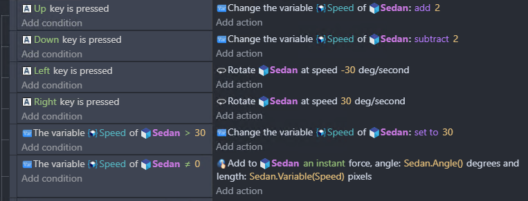

I have developed my own driving game! Unlike other games which carelessly encourage reckless driving, this game implements a speed limiter, ensuring that everyone gets to the finish line in a nice and orderly fashion:

This hasn't stopped some people from going suspiciously fast - can you beat my time and figure out what's going on?

Hint 1. When does the limiter apply?