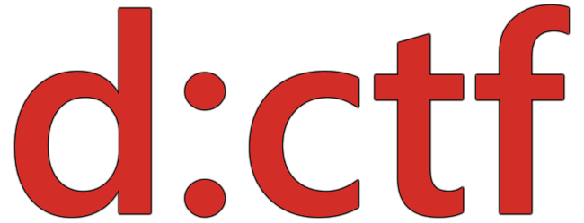

# d:CTF 2023

The CTF competition arranged for the d:hack 2023 hackathon at DIPS AS.

Challenges designed by @raymonshansen, @olivernilssen, @orjanj and @jaalu.

## Setup

If you have Docker Compose installed, you can run the challenges yourself by cloning the project and running `docker-compose up` in the root directory.

Note that *Next Generation Calculator* is commented out as it is very resource-intensive.

## Challenge types

Challenges are divided into five categories:

* *Crypto*: challenges about cryptography and code breaking
* *Investigation*: challenges about reverse-engineering secrets and data from files and programs
    * This category covers both *reverse-engineering* and *forensics* categories in other CTFs
* *Pwn*: challenges about discovering and exploiting vulnerabilities
* *Misc*: challenges about creative problem solving
* *Web*: challenges about exploiting vulnerabilities in web applications

## Useful tools 

### Windows utilities

* [Windows Sandbox](https://learn.microsoft.com/en-us/windows/security/application-security/application-isolation/windows-sandbox/windows-sandbox-overview) lets you set up disposable Windows environments quickly - nice if you only need a tool for a specific challenge!
* [Windows Subsystem for Linux](https://learn.microsoft.com/en-us/windows/wsl/install) lets you set up a Linux environment as part of your Windows installation.

### Programming

* If you're new to programming, [Python](https://www.python.org/) is a nice scripting language with lots of resources available.
    * [Automate the Boring Stuff](https://automatetheboringstuff.com/) is a good practical guide to Python
* Some challenges may require the [.NET SDK](https://dotnet.microsoft.com/en-us/download/visual-studio-sdks)

### Cryptography

* [CyberChef](https://gchq.github.io/CyberChef/) - a Swiss army knife of cryptography, which offers encryption, decryption and general file analysis tools
* [DCode](https://www.dcode.fr/en) - handy utilities for analyzing and breaking classical ciphers 

### Investigation/Reverse engineering

* [GHIDRA](https://ghidra-sre.org/) - a full software reverse engineering suite, offering disassembly, decompilation, and graphing
* [IDA Free](https://hex-rays.com/ida-free/) - the free version of the established reverse-engineering and debugging toolkit, also offers a decompiler
* [dnSpy](https://github.com/dnSpy/dnSpy) - .NET assembly decompiler and editor
* [dotPeek](https://www.jetbrains.com/decompiler/) - JetBrains' .NET decompiler
* [Binwalk](https://github.com/ReFirmLabs/binwalk/wiki/Quick-Start-Guide) - file analysis tool

### Web

* The browser *developer tools* -- accessible with the shortcut <kbd>F12</kbd> in [Firefox](https://developer.mozilla.org/en-US/docs/Learn/Common_questions/Tools_and_setup/What_are_browser_developer_tools) and [Chromium-based browsers](https://developer.chrome.com/docs/devtools/open/) 
* [Postman](https://www.postman.com/) - lets you craft your own HTTP requests to web apps
* [Fiddler](https://www.telerik.com/download/fiddler) - lets you observe traffic to and from your computer

### Pwn

* [Burp Suite](https://portswigger.net/burp/communitydownload) - toolkit to map and exploit vulnerabilities in web applications
* [Pwntools](https://docs.pwntools.com/en/stable/) - a Python library with utilities for networking, exploit development and common CTF tasks
